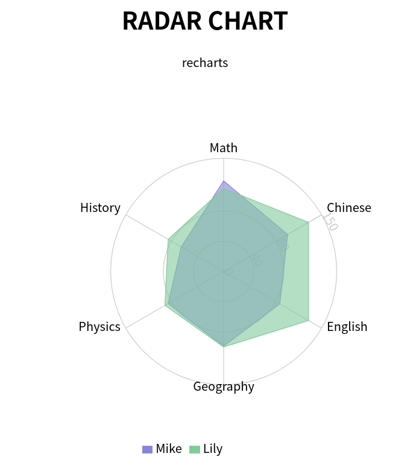

### Article for step by step process
https://medium.com/wesionary-team/radar-chart-with-recharts-6aa3a0b2480e

## Available Scripts

In the project directory, you can run:

### `yarn install`
Installs the required dependencies.

### `yarn start`

Runs the app in the development mode. 
Open [http://localhost:3000](http://localhost:3000) to view it in the browser.

The page will reload if you make edits. 
You will also see any lint errors in the console.

